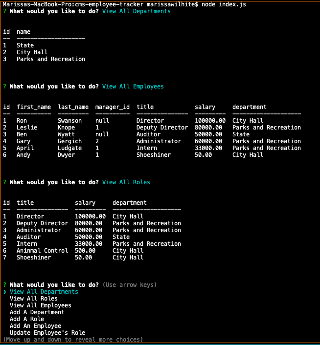

# Employee Tracker

## Description
Employee Tracker is a command-line application built to manage a company's database, allowing the user to easily view and interact with the information.

## Installation
This Application requires:
* Node
* MySQL2
* Inquirer
* Console Table

## Screenshot

## Usage
The employee tracker can be initialized by running the command `node index.js`. With the Employee Tracker, the user is able to take the following actions:

* View All Departments
* View All Roles
* View All Employees
* Add a Department
* Add a Role
* Add an Employee
* Delete a Department
* Delete a Role
* Delete an Employee
* Update an Employee's Role
* View Total Utilized Budgets by Department

## Walkthrough / Demo
